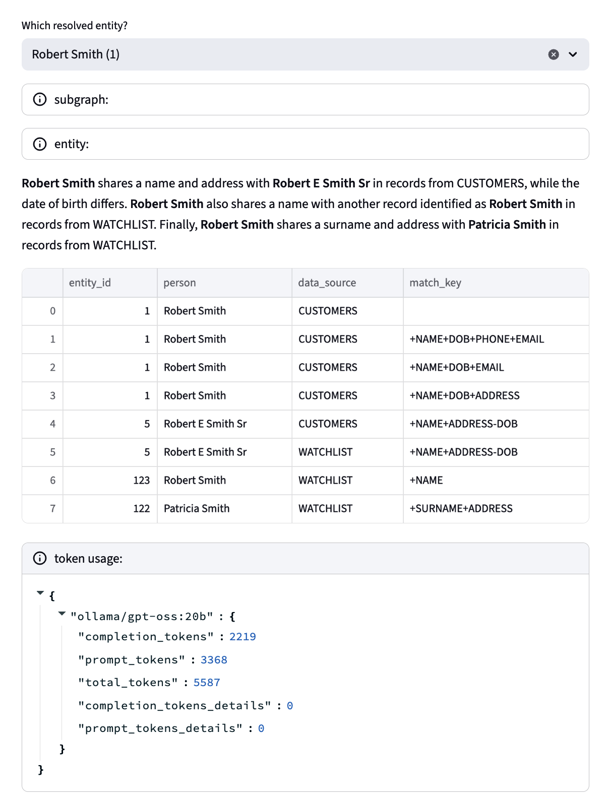

# dylifo

DSPy summary of Senzing ER results


## set up

This library uses [`poetry`](https://python-poetry.org/docs/) for
package management, and first you need to install it. Then run:

```bash
poetry update
```

Also download/install `Ollama` <https://ollama.com/> and pull the
models you wish to use, for example:

```bash
ollama pull gpt-oss:20b
```

Modify the `config.toml` configuration file to change models, adjust
parameters, etc.

If you're not running locally, be sure to set the `OPENAI_API_KEY`
environment variable.

For the interactive demo, you need to pull the latest Docker container
for Senzing:

```bash
docker pull senzing/serve-grpc:latest
```


## demo

Run the `demo.py` script with one of the JSON data files, for example:

```bash
poetry run python3 demo.py data/get.json
```

For an interactive UI based on [`Streamlit`](https://streamlit.io/):
first launch this container and have it running in the background:

```bash
docker run -it --publish 8261:8261 --rm senzing/serve-grpc
```

Then run:

```bash
poetry run streamlit run stream.py data/get.json
```
---



---

<details>
  <summary>License and Copyright</summary>

Source code for **Dylifo** plus logo, documentation, and examples have
an [MIT license](https://spdx.org/licenses/MIT.html) which is succinct
and simplifies use in commercial applications.

All materials herein are Copyright © 2025 Senzing, Inc.
</details>

Kudos to 
[@brianmacy](https://github.com/brianmacy),
[@jbutcher21](https://github.com/jbutcher21),
[@docktermj](https://github.com/docktermj),
[@cj2001](https://github.com/cj2001),
and the kind folks at [GraphGeeks](https://graphgeeks.org/) for their support.
</details>


## Star History

[](https://star-history.com/#derwenai/dylifo&Date)
